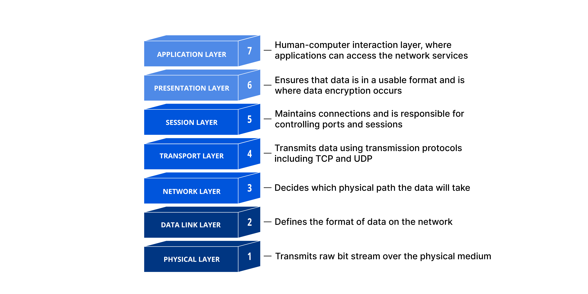

# OSI MODEL

Open System Interconnection
It is a conceptual model used to describe the function of telecommunication or computer systems into seven abstraction layers. These layers help in understanding and designing communication systems by breaking down the complex process of communication into more manageable and organized components.

## Seven Layers of OSI model

- Physical Layer
- Data Link Layer
- Network Layer
- Transport Layer
- Session Layer
- Presentation Layer
- Application Layer

### Physical Layer

Deals with the physical connection between devices such as cable, network interface card, and how binary data is being transmitted in physical medium.

### Data Link Layer

This layer is responsible for creating reliable link between nodes. The main function of this layer is to make sure
that data transfer should be error-free from one node to another node and it also handles issues such as framing, addressing, and error detection.

### Network Layer

This layer mainly focuses on the logical addressing and routing of data packets between different devices on different networks. It select the sortest path to transmit the packet, from the number of routes available. Segmentation in this layer is referred to as **Packet**

### Transport Layer

It is the heart of the OSI model it provides services to the application layer and takes services from the network layer. It ensures the reliable delivery of data between devices. It also provides acknowledgment of the successful data transmission or re-transmitted, if error occur.

#### Function of Transport layer

- **Segmentation and Reassembly** :
  This layer accepts the data from the Session Layer and divides data into small units of data called segments. Each segment contains sequence, port number, and checksum.
  On the receiver's end, it resembles the segments and sends data to the session layer
- **Flow controls** : It also increases or decreases data at a rate that matches the connection speed of the receiver's device.
- **Error Control** : If any of the segments is lost/corrupted then it requests for re-transmission of that segment.

#### Services Provided by the Transport layer

- Connection-Oriented Service (TCP)
- Connectionless Service (UDP)

  In Connection-Oriented communication establishes a logical connection between the sender and receiver before data exchange, ensuring reliability, and gives feedback on successful data transfer. On the other hand, Connectionless communication does not establish the connection before data transfer, it does not give feedback after data transmission, and it is connections,unreliable.

  example:

  **Connection-Oriented**: sending messages,and emails (where data loss is unbearable)

  **Connectionless**: games, streaming video, calls (where data losscan be bearable).

### Session Layer

This layer is responsible for establishing connections, maintenance of sessions, and authentications. This layer also provides Synchronization by adding checkpoints in data and allows two systems to communicate via half-duplex or full-duplex.

### Presentation Layer

This layer collects data the from Application layer converts it into binary form, encrypts and decrypts the data, and compresses the bit to send over the network.

### Application Layer

It is the topmost layer of the OSI model and it is closest to the end user, it produces data to be transferred over the network and provides protocols such as HTTP, FTP, POP, and SMTP.

## References

- [What is the OSI Model? – Layers of OSI Model- GeeksForGeeks](https://www.geeksforgeeks.org/open-systems-interconnection-model-osi/)

- [OSI Model-Javatpoint](https://www.javatpoint.com/osi-model)

* [OSI Model- Youtube](https://www.youtube.com/watch?v=vv4y_uOneC0&ab_channel=TechTerms)
